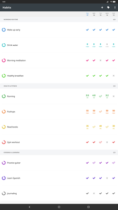
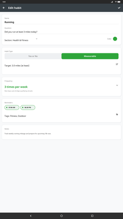
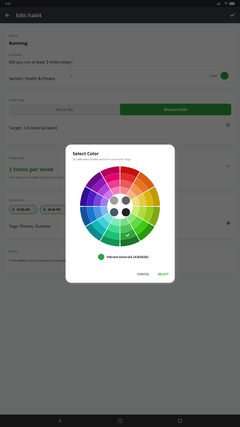
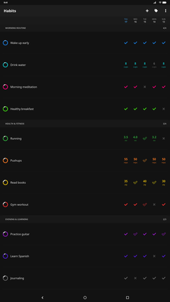
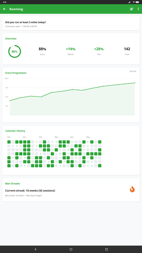
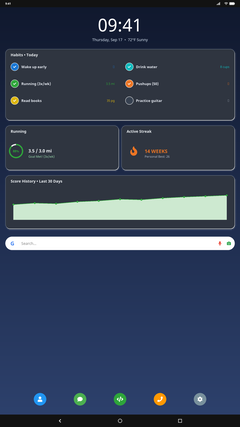

<h1 align="center">Loop Habit Tracker (Enhanced)</h1>

<p align="center">
  <a href="https://github.com/Maurs9/Habit-tracker/releases/latest">
    
  </a>
  
  <a href="LICENSE.txt">
    
  </a>
</p>

<p align="center">
  An enhanced, open-source habit tracking app for Android designed to help you create and maintain positive long-term habits.
  <br>
  <strong>Completely ad-free, tracker-free, and 100% offline.</strong>
</p>

<p align="center">
  <a href="https://github.com/Maurs9/Habit-tracker/releases/latest">
    
  </a>
</p>

---

## 🌟 What's New in v2.6

* **🎯 Clean Check-in & Target-Focused Dialogs**: Streamlined entry dialogs for measurable habits by removing the redundant "Value" row to cleanly highlight only the specific target or limit alongside notes and quick entry actions.
* **🎨 52-Slot Harmonic Palette & High-Contrast Harmonization (DB v30)**: Automatic color remapping onto the expanded 52-slot harmonic color wheel by hue family and tone. Single readable, high-contrast color harmonization across habit names, score rings, and action buttons in Light, Dark, and Pure Black AMOLED themes.
* **✅ Accurate At-Most Habit Completion & Scoring**: Habits with "at most" limits now correctly register as completed whenever measurements stay within limit, consistently matching list checkmarks, history calendar indicators, streaks, widgets, and score calculations.
* **⚡ Startup Robustness & Boundary Safety**: Stored frequencies outside the valid range are coerced safely to prevent startup crashes. Chart flings are strictly bounded at the oldest data, and start-of-day widget auto-refresh is restored.
* **🚀 Startup Readiness & Background Coordinator**: Offloads database and habit history initialization off the UI thread behind lifecycle-safe readiness gates, eliminating app launch lags and ANRs while showing responsive loading states.
* **♿ Comprehensive Accessibility & Keyboard Navigation**: Full screen reader (TalkBack) support across all statistics charts (Frequency, Score, History, Streaks, Target), keyboard date navigation and habit movement, descriptive widget labels, and accessible entry actions.
* **🛡️ Habit Editor Refinements & Draft Protection**: Unsaved changes are protected with dirty-state confirmation before discarding. Complete editor draft state (types, frequencies, targets, colors, tags) survives device rotation, interruptions, and dialog recreations.
* **📊 Adaptive Statistics & System Font Scaling**: Chart text, layouts, and statistics headers dynamically scale with Android system font sizing for superior readability and touch targets across all themes.
* **📏 Streamlined Compact Layout**: Minimalist 1dp row spacing, 48dp touch targets, and streamlined section headers allow viewing maximum habits at a glance without unnecessary scrolling.
* **📁 Habit Sections**: Organize daily routines into custom sections (e.g., *Morning Routine*, *Health & Fitness*, *Evening & Learning*). View live *done / total* counts in informational section headers.
* **↕️ Seamless Long-Press Habit Reordering**: Reorder habits cleanly inside their sections via smooth drag-and-drop when sorted Manually. Clean card design with no intrusive drag handle icons, haptic feedback on elevation, atomic database persistence upon release, and instant in-place long-press for multi-selection mode (CAB).
* **🎯 Flexible Frequencies for Measurable Habits**: Measurable/numerical habits now enjoy full frequency support (e.g., 3 times per week, 5 times per month, every 2 days). Qualifying rest days automatically receive outline checkmarks (`YES_AUTO`), cleanly distinguished from measured values across cards, widgets, and CSV exports.
* **🎨 4-Ring Donut Color Wheel Picker**: Intuitive harmonic color wheel with 52 vibrant, non-overlapping colors across 4 concentric rings (Deep, Vibrant, Soft, Pastel) and 12 radial hue sectors, plus 4 neutral swatches in the center hub. High contrast calibrated for both Light and Dark themes.
* **☀️ High-Contrast "Today" Column**: Subtle, adaptive vertical highlight behind today's checkmark column (calibrated at 6% light, 16% dark, and 20% AMOLED pure black) keeping today's entries instantly recognizable.
* **🏷️ Interactive Tag Picker**: Easily assign, organize, and filter habits with an interactive multi-select tag checklist dialog.
* **⏰ Multiple Daily Reminders & Snooze**: Schedule multiple notification times for any habit across chosen weekdays, with direct snooze actions from the notification tray.

---

## 📱 Screenshots

[](screenshots/1.png)
[](screenshots/2.png)
[](screenshots/3.png)
[](screenshots/4.png)
[](screenshots/5.png)
[](screenshots/6.png)

---

## ✨ Key Features

* **Minimalist & Fast**: Clean, modern interface optimized for speed and battery life without bloat.
* **Advanced Habit Scoring**: Scientifically-derived scoring formula calculates habit strength over time. Missing a single day won't destroy weeks of progress.
* **Flexible Schedules**: Daily habits, weekly quotas (e.g., 3 times per week), or repeat intervals (e.g., every 2 days).
* **Measurable Habits**: Track numerical targets (e.g., cups of water, pages read, workout minutes) in addition to yes/no habits.
* **Interactive Home Screen Widgets**: Check off habits or monitor scores directly from your Android home screen.
* **Total Privacy & Offline-First**: No accounts, no cloud dependencies, no analytics. Your data remains strictly on your device.
* **Export & Import Data**: Export your complete history anytime to CSV or raw SQLite database backups.

---

## 📥 Installation

Because this enhanced edition contains custom features (Sections, 4-Ring Color Wheel, Measurable Habit Frequencies, Tag Picker) not present in upstream app stores, install the APK directly from GitHub:

1. Go to the [**Releases Page**](https://github.com/Maurs9/Habit-tracker/releases/latest).
2. Download the latest `uhabits-v...apk` file.
3. On your Android device, tap the downloaded APK to install.
   *(If prompted, allow your browser or file manager permission to "Install unknown apps").*

> [!NOTE]
> The upstream version of Loop Habit Tracker is available on Google Play and F-Droid, but it does not include the custom Habit Sections, Compact Habit List Layout, Measurable Habit Frequencies, Tag Picker dialog, or the Donut Color Wheel introduced in this repository.

---

## 🛠️ Building from Source

### Prerequisites
* **Java Development Kit (JDK)**: 17
* **Android SDK**: API level 36 (Android 16), Build-Tools 35.0.0
* **Minimum Supported Device**: Android 9.0 (API level 28)

### Build Steps

1. Clone the repository:
   ```bash
   git clone https://github.com/Maurs9/Habit-tracker.git
   cd Habit-tracker
   ```

2. Build the debug APK:
   ```bash
   # On Windows:
   .\gradlew.bat :uhabits-android:assembleDebug

   # On Linux / macOS:
   ./gradlew :uhabits-android:assembleDebug
   ```

3. The generated APK will be available at:
   ```
   uhabits-android/build/outputs/apk/debug/uhabits-android-debug.apk
   ```

4. Run unit tests:
   ```bash
   # On Windows:
   .\gradlew.bat :uhabits-core:jvmTest :uhabits-android:testDebugUnitTest

   # On Linux / macOS:
   ./gradlew :uhabits-core:jvmTest :uhabits-android:testDebugUnitTest
   ```

See [the build guide](docs/BUILD.md) for SDK setup and [the testing guide](docs/TEST.md)
for focused checks and device requirements.

---

## 📄 License & Credits

* Based on [Loop Habit Tracker](https://github.com/iSoron/uhabits) by Álinson Santos Xavier.
* Licensed under the [GNU General Public License v3.0 (GPLv3)](LICENSE.txt).
